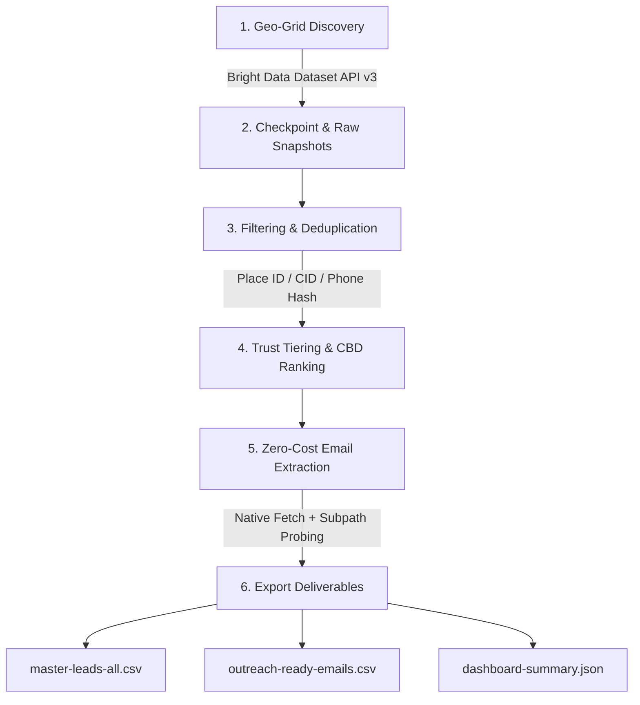

# 🇦🇺 Bright Data Google Maps Crawler (Australia Master Suite)

[](https://nodejs.org)
[](package.json)
[](config/default.json)
[](docs/API_COST_OPTIMIZATION.md)

Production-grade, highly modular Google Maps Lead Generation Crawler designed specifically for the Australian market. Originally engineered for the **Hairfolli B2B Hair Salon Crawl** (~3,700 raw locations across Australia) and packaged for seamless agency reuse across multiple client verticals (Hair Salons, Commercial Cleaning, Beauty Clinics, Gyms, Dental, Medical, Trades, etc.).

---

## ⚡ Key Highlights & Architecture



- **100% Zero External NPM Dependencies**: Built using native Node.js (v18+) modules (`node:fs/promises`, `node:crypto`, `node:child_process`, `fetch`). No heavy puppeteer, selenium, or bloated packages required.
- **Maximum API Credit Efficiency**:
  - Utilizes **Bright Data Google Maps Dataset API** (`gd_m8ebnr0q2qlklc02fz`) rather than fragile and expensive SERP scrapers.
  - Hard safety cap (`per_key_cap: 4,500`) to guarantee free-trial accounts (5,000 credits) never incur unexpected credit card charges.
  - Multi-key rotation pool with SHA-256 fingerprint tracking.
- **Atomic State Machine (`crawl-state.json`)**:
  - Every city/cluster is tracked individually.
  - **100% Idempotent Resume**: Interrupted runs, disconnects, or restarts will **never** re-trigger or re-bill completed locations.
- **Strategic Australian Coordinate Grid (Waves 1-4)**:
  - 38+ pre-configured clusters covering all Australian states (NSW, VIC, QLD, WA, SA, ACT, TAS, NT) with calibrated zoom levels (`zoom: 14` for high-density CBDs, `zoom: 13` for regional markets).
- **$0 Website & Email Extraction Engine**:
  - Does NOT waste paid proxy credits to scrape company websites. Uses direct asynchronous multi-worker HTTP requests with strict timeouts and subpath probing (`/contact`, `/contact-us`, `/about`).
  - Enterprise regex & blacklist to strip tracking pixels, CDN artifacts, image filenames, and CMS boilerplate (Wix, Shopify, Sentry).

---

## 🚀 Quick Start (3 Minutes)

### 1. Requirements
- Node.js >= 18.0.0
- `curl`

### 2. Configure Your Bright Data API Key
Add your key to `~/.config/brightdata/hairfolli_api_keys` (preferred) or create a `.env` file:
```bash
# Option A: Global config file
mkdir -p ~/.config/brightdata
echo "your_brightdata_api_key_here" > ~/.config/brightdata/hairfolli_api_keys
chmod 600 ~/.config/brightdata/hairfolli_api_keys

# Option B: Local project .env
echo "BRIGHTDATA_API_KEY=your_brightdata_api_key_here" > .env
```

### 3. Verify Without Spending Credits (Dry-Run)
Inspect the planned coordinate grid, zoom levels, and budget:
```bash
node src/cli.mjs crawl --preset hairfolli --dry-run
```

### 4. Run the Full Autonomous Pipeline
Execute all 4 stages (Crawl -> Dedupe & Tier -> Scrape Emails -> Export):
```bash
node src/cli.mjs run --preset hairfolli
```

---

## 🛠️ Command-Line Interface (CLI)

The runner supports modular execution so you can run individual stages or test isolated components:

| Command | Action | Description |
|---|---|---|
| `node src/cli.mjs run` | Full Pipeline | Executes Stage 1 through 4 end-to-end. |
| `node src/cli.mjs crawl` | Stage 1: Crawl | Triggers Bright Data Maps Dataset API and saves raw snapshots. |
| `node src/cli.mjs process` | Stage 2: Dedupe | Normalizes addresses, filters closed shops, dedupes by Place ID / CID, and ranks by Trust Tier. |
| `node src/cli.mjs emails` | Stage 3: Email | Crawls business websites with 35 async workers to extract verified emails for $0. |
| `node src/cli.mjs export` | Stage 4: Export | Compiles final CSV deliverables and executive KPI metrics. |

### Powerful CLI Flags:
```bash
# Limit to 1 location for immediate smoke testing:
node src/cli.mjs crawl --preset commercial-cleaning --max-locations 1

# Filter by Australian State:
node src/cli.mjs crawl --preset hairfolli --state VIC

# Filter by Geographic Waves (e.g. Wave 1 = Sydney Metro, Wave 3 = Melbourne/Brisbane/Perth):
node src/cli.mjs crawl --preset beauty-spas --waves 1,3

# Custom search query without creating a preset:
node src/cli.mjs run --keyword "physiotherapy clinic" --state NSW
```

---

## 📁 Repository Structure

```
brightdata-maps-au-crawler/
├── README.md                          # Master documentation & technical overview
├── package.json                       # Project manifest (ES module, zero-dependencies)
├── .gitignore                         # Git safety exclusions (tokens, logs, temp data)
├── config/
│   ├── default.json                   # 38 AU coordinates, zoom levels, trust tiers, rate limits
│   └── presets/
│       ├── hairfolli.json             # Hair salon & hairdresser configuration
│       ├── commercial-cleaning.json   # Commercial cleaning & office cleaners
│       └── beauty-spas.json           # Beauty salons, day spas & skin clinics
├── src/
│   ├── cli.mjs                        # Master CLI entrypoint
│   ├── core/
│   │   ├── brightdata.mjs             # Bright Data Dataset API v3 client (trigger, poll, download)
│   │   ├── key-manager.mjs            # Multi-key pooling, SHA-256 fingerprinting & 4500-cap guard
│   │   └── state.mjs                  # Atomic checkpoint engine (crawl-state.json)
│   ├── steps/
│   │   ├── 01-crawl.mjs               # Step 1: Maps discovery crawler
│   │   ├── 02-process.mjs             # Step 2: Category filtering, deduplication & trust tiering
│   │   ├── 03-email.mjs               # Step 3: Zero-cost website email extractor
│   │   └── 04-export.mjs              # Step 4: CSV compilation & KPI dashboard generator
│   └── utils/
│       ├── geo.mjs                    # Haversine distance calculator to Sydney/custom CBD
│       └── email-cleaner.mjs          # Strict email regex parser, domain & asset blacklist
└── docs/
    ├── API_COST_OPTIMIZATION.md       # Sách trắng tối ưu chi phí Bright Data (Tránh bị trừ tiền thẻ)
    └── TEAM_HANDOFF_GUIDE.md          # SOP bàn giao cho anh em công ty vận hành trong 5 phút
```

---

## 🏆 Trust Tiers & Ranking Algorithm

Leads are systematically tiered based on verified Google Maps review counts:

| Tier | Label | Review Threshold | Description |
|:---:|:---|:---:|:---|
| **A+** | Enterprise / High Authority | **500+** reviews | Dominant market leaders, massive customer base |
| **A** | Top Established | **200 – 499** reviews | Highly reputed local anchors |
| **B** | Strong Local Presence | **100 – 199** reviews | Consistent, established businesses |
| **C** | Active Small Business | **30 – 99** reviews | Prime sweet spot for B2B outreach |
| **D** | Emerging / Boutique | **10 – 29** reviews | Growing or boutique operations |
| **E** | New / Unranked | **< 10** reviews | New listings or low digital review engagement |

Ranking precedence within final deliverables:
1. **Trust Tier** (A+ → A → B → C → D → E)
2. **Proximity to CBD** (Ascending Haversine distance)
3. **Total Reviews Count** (Descending)
4. **Google Star Rating** (Descending)

---

## 📑 Deliverables & Output Schema

Each execution generates a self-contained report folder in `reports/<preset-name>-<date>/`:

- **`master-leads-all.csv`**: Full master list of all verified, open, Australian businesses with complete metadata, phone numbers, addresses, ratings, reviews, and Google Maps direct links.
- **`outreach-ready-emails.csv`**: Filtered subset containing **only leads with verified emails**, formatted for instant 1-click import into cold-email platforms (Instantly, Lemlist, Apollo).
- **`dashboard-summary.json`**: Machine-readable audit file with counts, percentage coverage, and tier distributions.
- **`snapshots/*.json`**: Raw per-location JSON snapshots for complete compliance and historical auditability.

---

## 🛡️ Best Practices & Compliance

- **Spam Act 2003 (Australia)**: When conducting commercial email outreach in Australia, ensure compliance with the [Australian Communications and Media Authority (ACMA)](https://www.acma.gov.au/avoid-sending-spam) guidelines: consent, identity, and an operational unsubscribe mechanism.
- **API Key Confidentiality**: Never commit API keys or push secret files to remote git repositories. Always verify that `.gitignore` excludes your local credentials.

---

## 👨‍💻 Maintainer & Authors

- **Maintainer**: Daniel Nguyen ([@danielnguyen241](https://github.com/danielnguyen241))
- **Organization**: HiAgency Australia ([hiagency.au](https://hiagency.au))
- **Internal License**: Proprietary / Private Agency Codebase
